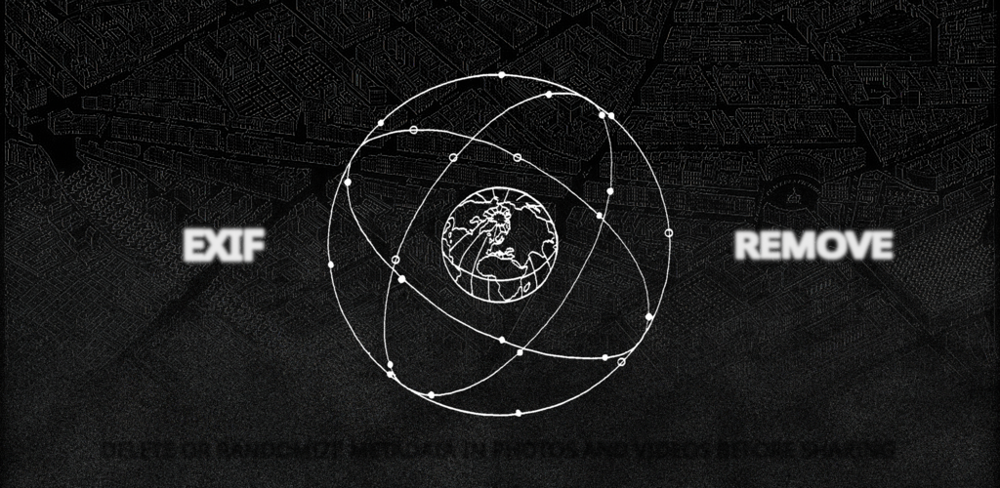
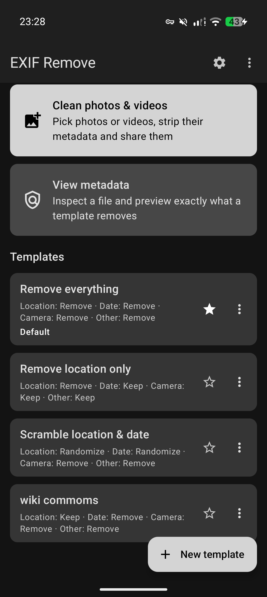
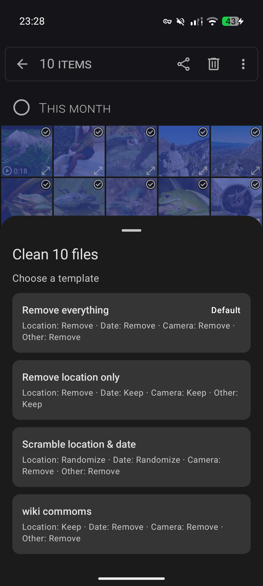
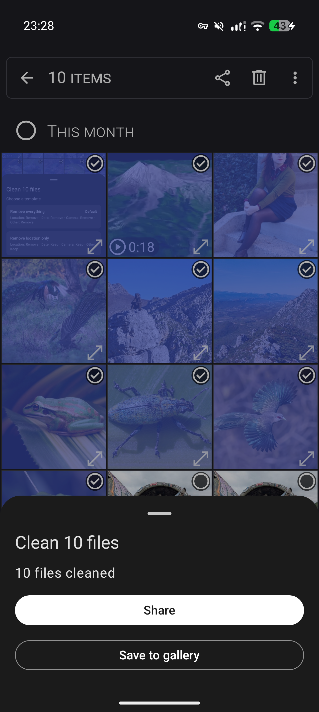
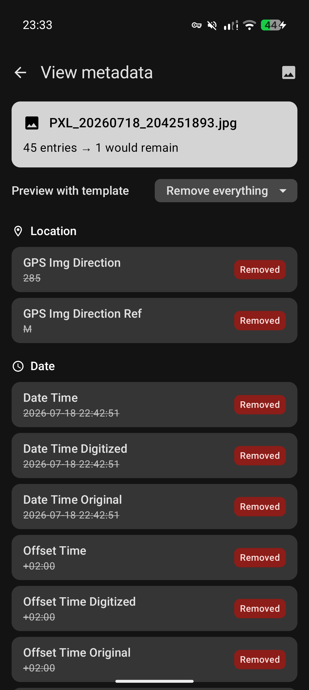
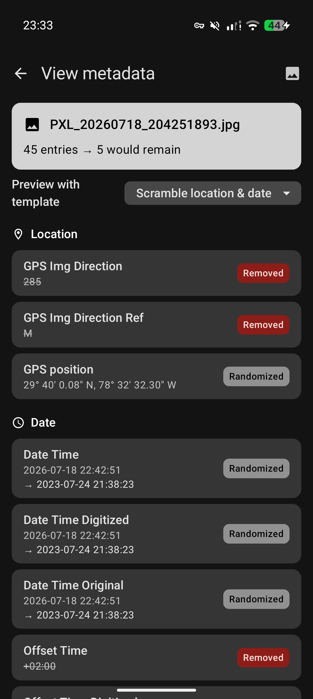

# EXIF Remove



Remove EXIF and other metadata from photos and videos before you share them.

Share files to EXIF Remove from any app, pick a template, and pass the cleaned
copies on. Works offline, no tracking, free software.

## Features

- Share target for photos and videos, one or many at a time
- Templates set what happens to each category: location, date and time, camera
  info, everything else. Each is kept, removed or randomized.
- Three built-in templates, all editable. Add your own and set a default.
- JPEG, PNG and WebP are cleaned without re-encoding, so the pixels are
  untouched. HEIC and AVIF are converted to clean JPEGs.
- MP4, MOV and 3GP are cleaned in place. Streams are never re-encoded, so it is
  instant even on large videos.
- Removes data hidden after the end of an image, such as a motion photo's video
  or an Ultra HDR gain map. Both carry a second copy of the metadata.
- Always removes XMP, IPTC, comments and embedded thumbnails. Keeps ICC color
  profiles, so colors do not shift.
- Every cleaned image is re-parsed and checked before you get it. Anything that
  cannot be proven clean is withheld instead of shared.
- Cleaning report for each file: what was removed, kept or scrambled, and what
  was hidden inside it.
- Metadata viewer to inspect any file and preview what a template would do.
- Optional random output file names, since names leak information too.
- Save to the gallery, or skip the picker and clean with your default in one tap.
- Material 3 interface, light and dark, dynamic color.

## Screenshots

<p>
  
  
  
  
  
</p>

## Building

Needs a JDK and the Android SDK with platform 37.

```
./gradlew assembleRelease
```

Release builds are reproducible: building the same commit twice gives a
byte-identical APK.

## Privacy

Nothing is collected and there is no network access, because the app does not
request the internet permission. See [PRIVACY.md](PRIVACY.md).

## License

Copyright (C) 2026 Jakob Kreft

Free software under the GNU General Public License, version 3 or later. See
[LICENSE](LICENSE). Every source file carries an SPDX `GPL-3.0-or-later` header.

---

<a href="https://buymeacoffee.com/jaak"></a>
